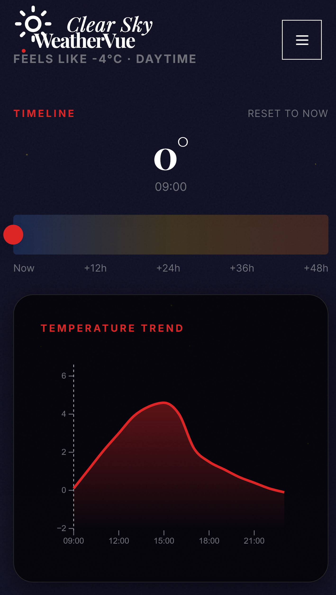

# WeatherVue 2.0

<div align="center">
  <h3>Atmospheric Intelligence for the Modern Age</h3>
  <p>A next-generation weather dashboard featuring glassmorphism, WebGL visualizations, and award-winning UI/UX.</p>
</div>

<p align="center">
  
</p>

<p align="center">
  
</p>

## ✨ Features

- **🎨 Award-Winning Design**: Immersive Glassmorphic UI with dynamic, weather-reactive backgrounds (Three.js WebGL).
- **⏱️ Precision Timeline**: Interactive scrubber to travel through time and see 48-hour forecasts instantly.
- **📊 Advanced Visualization**: D3.js powered temperature graphs with gradient fills and interactive inspection.
- **🌍 Global Coverage**: Real-time data from Open-Meteo API for any location on Earth.
- **🌗 Smart Theming**: Automatically adapts to day/night cycles and weather conditions (Rain, Snow, Clear, etc.).
- **⚡ Performance First**: Built with Vite + Vue 3 for blazing fast load times and smooth 60fps animations.
- **📱 Fully Responsive**: Optimized experience across mobile, tablet, and desktop.
- **♿ Accessible**: Full keyboard navigation, screen reader support, and "Terminal" high-contrast theme.

## 🛠️ Tech Stack

- **Framework**: [Vue 3](https://vuejs.org/) (Composition API, Script Setup)
- **State Management**: [Pinia](https://pinia.vuejs.org/)
- **Build Tool**: [Vite](https://vitejs.dev/)
- **Styling**: [Tailwind CSS](https://tailwindcss.com/) + Custom CSS Variables
- **Visualizations**: [D3.js](https://d3js.org/) (Charts), [Three.js](https://threejs.org/) (Backgrounds)
- **Animations**: [GSAP](https://greensock.com/gsap/)
- **Icons**: [Lucide Vue](https://lucide.dev/)
- **Data Source**: [Open-Meteo API](https://open-meteo.com/)

## 🚀 Getting Started

### Prerequisites

- Node.js 18+
- npm or pnpm

### Installation

1.  **Clone the repository**

    ```bash
    git clone https://github.com/tzii/WeatherVue.git
    cd WeatherVue
    ```

2.  **Install dependencies**

    ```bash
    npm install
    ```

3.  **Start development server**

    ```bash
    npm run dev
    ```

4.  **Build for production**
    ```bash
    npm run build
    ```

## ⚙️ Configuration

Create a `.env` file in the root directory to configure optional services (like Azure Translation):

```env
VITE_AZURE_TRANSLATOR_KEY=your_key_here
VITE_AZURE_TRANSLATOR_REGION=eastus
```

_Note: The core weather functionality works out-of-the-box without any API keys!_

## 📂 Project Structure

```
src/
├── components/        # Vue components
│   ├── canvas/        # WebGL/Three.js background effects
│   ├── weather/       # Weather visualization components (Graphs, Forecasts)
│   └── ui/            # Reusable UI elements (Cards, Buttons)
├── composables/       # Shared logic (Hooks)
├── stores/            # Pinia state stores
├── services/          # API integrations
├── styles/            # Global CSS & Tailwind config
└── utils/             # Helper functions & constants
```

## 🤝 Contributing

Contributions are welcome! Please feel free to submit a Pull Request.

## 📄 License

This project is open source and available under the [MIT License](LICENSE).
